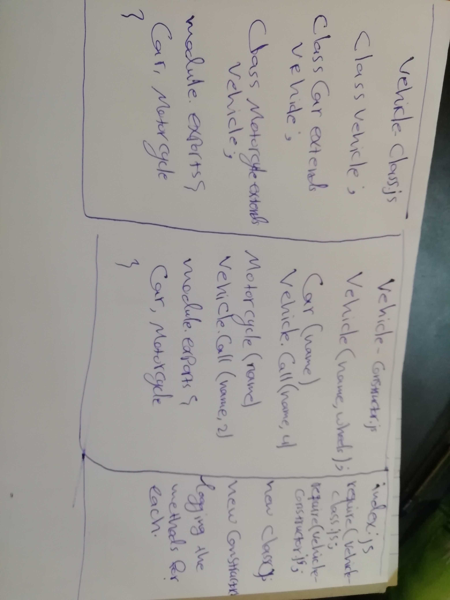

# LAB - Class 02

## Project Name

### Author: Ibrahim & Naseem

### Links and Resources

https://github.com/401-advanced-javascript-ibrahim/node-ecosystem/pull/2

https://github.com/401-advanced-javascript-ibrahim/node-ecosystem/commit/ec13d426547f5000fec84544bd97b7b8d1ccd846/checks?check_suite_id=410934200

### Setup

#### How to initialize/run your application (where applicable)
`npm run start` 

### Tests

#### How do you run tests?
`npm run test` 

#### Any tests of note?

you should have the packages installed in your machine first

#### Describe any tests that you did not complete, skipped, etc

